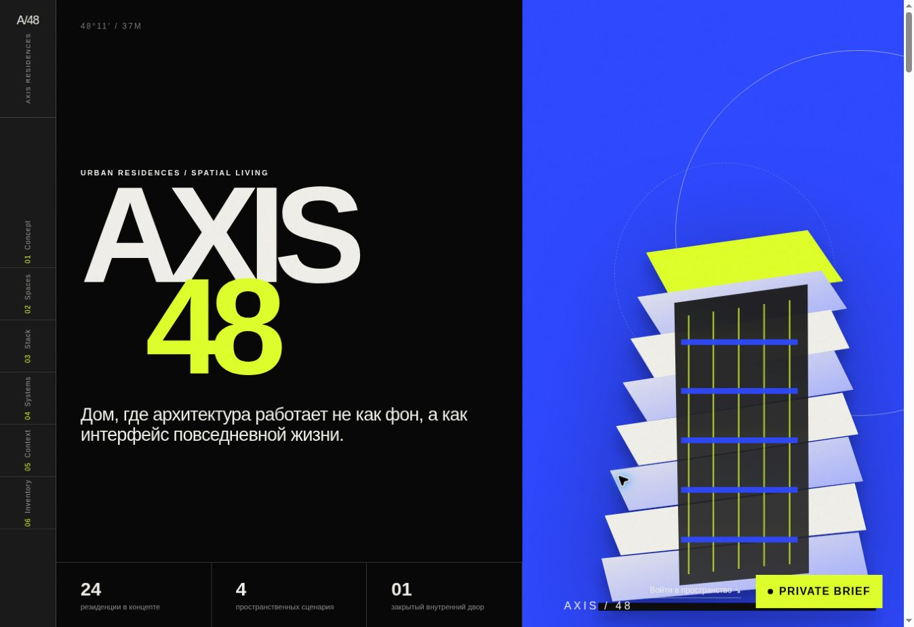

# AXIS 48

A concept residential property showcase with interactive space planning.



## Overview

A concept residential property showcase with interactive space planning. The layout adapts to desktop and mobile screens.

## Features

- Scene and floor selectors
- Lighting and privacy controls
- Room filters and a space brief dialog

## Tech Stack

- HTML5
- CSS3
- Vanilla JavaScript

## Project Structure

```text
├── index.html
├── assets/css/style.css
├── assets/js/app.js
├── assets/img/
├── docs/preview.png
└── README.md
```

## Live Demo

https://dayiawan.github.io/axis-48/

## Running Locally

Open `index.html` directly in a browser or serve the folder with `python3 -m http.server 8000` and open `http://localhost:8000/`.

## Notes

- This is a frontend concept: on-page calculations, configurations and briefs are demonstrations, with no production backend.
