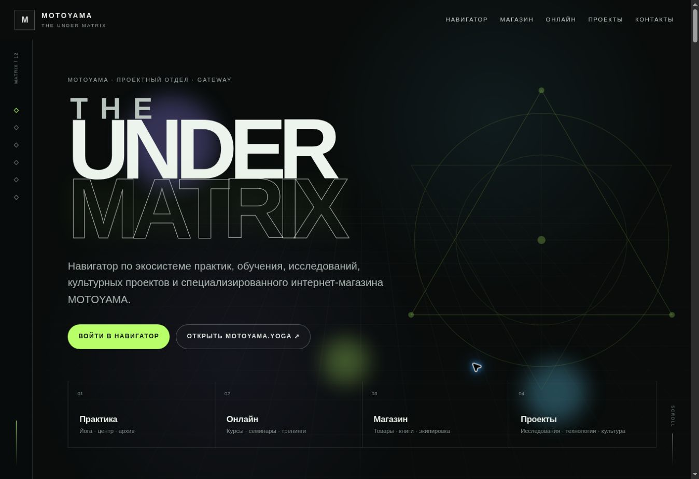
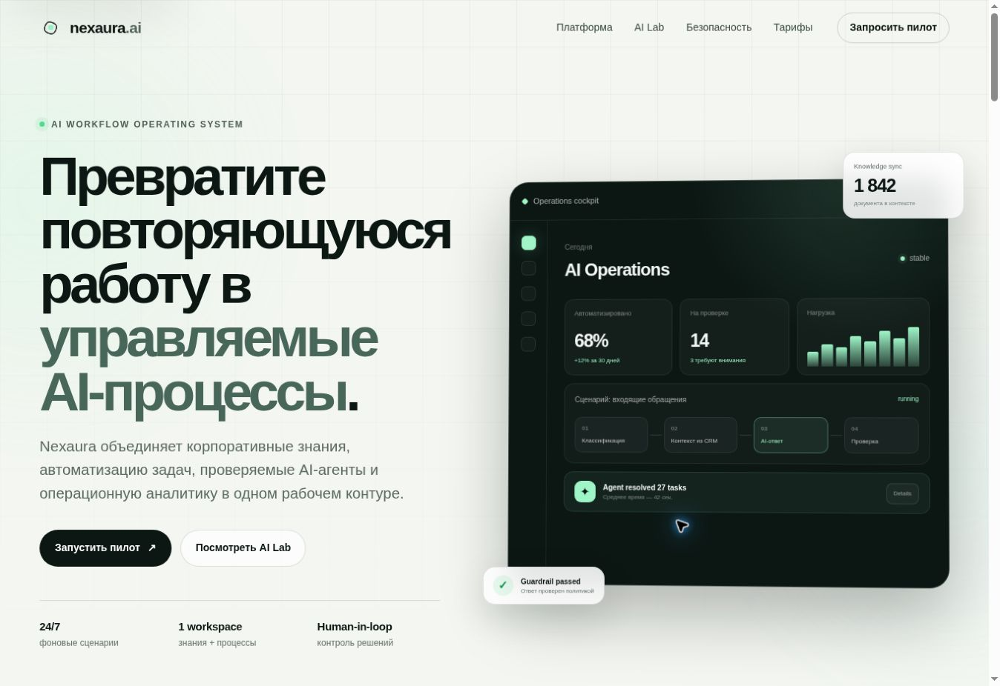
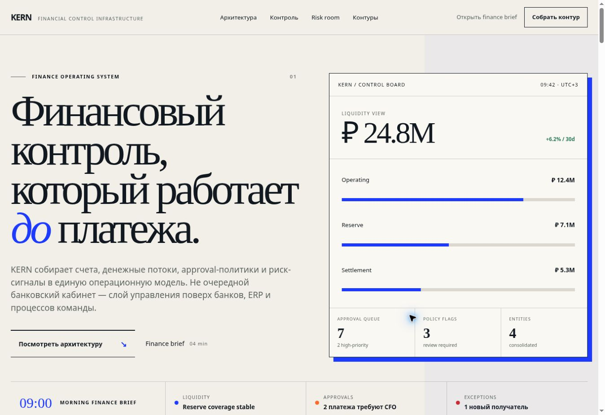
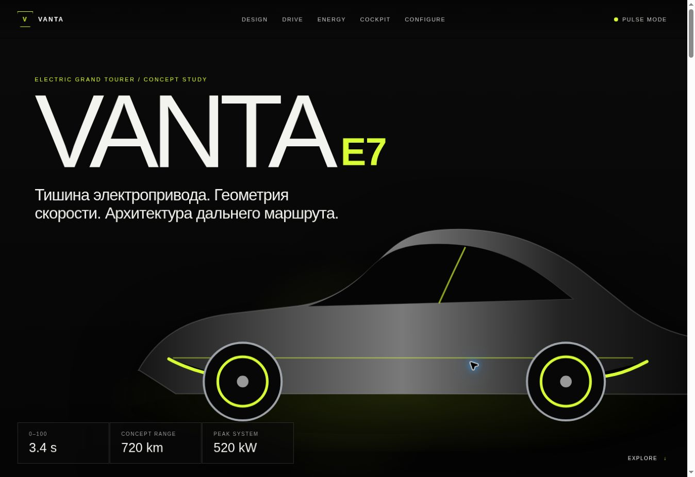
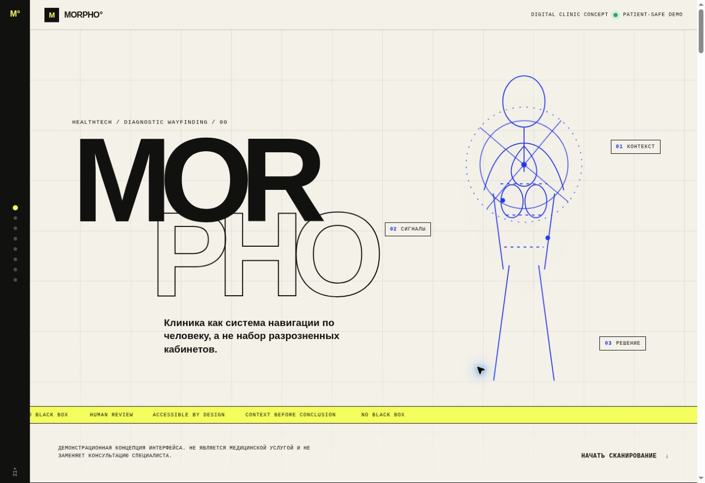
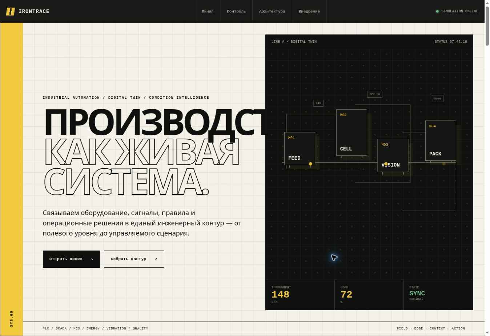

# Landing Pages Collection

A collection of 12 standalone frontend landing-page projects. Each project is included as source code in its own directory and also has a separate repository.

[Browse the live gallery](https://dayiawan.github.io/landing-pages-collection/)

## 01. TheUnderMATRIX

An interactive directory for the MOTOYAMA project ecosystem.

**Tech:** HTML · CSS · JavaScript

- [Live Demo](https://dayiawan.github.io/landing-pages-collection/01-the-under-matrix/)
- [Standalone Repository](https://github.com/DAYIAWAN/the-under-matrix)
- [Source in Collection](01-the-under-matrix/)

## 02. Service Maximum

An insurance services landing page with an illustrated editorial layout.

**Tech:** HTML · CSS · JavaScript

- [Live Demo](https://dayiawan.github.io/landing-pages-collection/02-service-maximum/)
- [Standalone Repository](https://github.com/DAYIAWAN/service-maximum)
- [Source in Collection](02-service-maximum/)

## 03. Screw Piles

A landing page for screw-pile foundations with a preliminary estimator and contact forms.

**Tech:** HTML · CSS · JavaScript · PHP (server only)

- [Live Demo](https://dayiawan.github.io/landing-pages-collection/03-screw-piles/)
- [Standalone Repository](https://github.com/DAYIAWAN/screw-piles)
- [Source in Collection](03-screw-piles/)

## 04. Vasyuki Chess

An editorial landing page inspired by the fictional Vasyuki chess tournament.

**Tech:** HTML · CSS · JavaScript

- [Live Demo](https://dayiawan.github.io/landing-pages-collection/04-vasyuki-chess/)
- [Standalone Repository](https://github.com/DAYIAWAN/vasyuki-chess)
- [Source in Collection](04-vasyuki-chess/)

## 05. Russian Music Assembly

An instrument showroom landing page with interactive collections and a request flow.

**Tech:** HTML · CSS · JavaScript

- [Live Demo](https://dayiawan.github.io/landing-pages-collection/05-russian-music-assembly/)
- [Standalone Repository](https://github.com/DAYIAWAN/russian-music-assembly)
- [Source in Collection](05-russian-music-assembly/)

## 06. Nexaura AI

A concept landing page for an AI operations platform.

**Tech:** HTML · CSS · JavaScript

- [Live Demo](https://dayiawan.github.io/landing-pages-collection/06-nexaura-ai/)
- [Standalone Repository](https://github.com/DAYIAWAN/nexaura-ai)
- [Source in Collection](06-nexaura-ai/)

## 07. KERN Fintech

A concept landing page for financial controls and payment workflows.

**Tech:** HTML · CSS · JavaScript

- [Live Demo](https://dayiawan.github.io/landing-pages-collection/07-kern-fintech/)
- [Standalone Repository](https://github.com/DAYIAWAN/kern-fintech)
- [Source in Collection](07-kern-fintech/)

## 08. AXIS 48

A concept residential property showcase with interactive space planning.

**Tech:** HTML · CSS · JavaScript

- [Live Demo](https://dayiawan.github.io/landing-pages-collection/08-axis-48/)
- [Standalone Repository](https://github.com/DAYIAWAN/axis-48)
- [Source in Collection](08-axis-48/)

## 09. VANTA E7

A concept landing page for an electric grand tourer.

**Tech:** HTML · CSS · JavaScript

- [Live Demo](https://dayiawan.github.io/landing-pages-collection/09-vanta-e7/)
- [Standalone Repository](https://github.com/DAYIAWAN/vanta-e7)
- [Source in Collection](09-vanta-e7/)

## 10. MORPHO

A concept clinical interface presented as an interactive landing page.

**Tech:** HTML · CSS · JavaScript

- [Live Demo](https://dayiawan.github.io/landing-pages-collection/10-morpho/)
- [Standalone Repository](https://github.com/DAYIAWAN/morpho)
- [Source in Collection](10-morpho/)

## 11. IRONTRACE

A concept industrial automation landing page with simulated production views.

**Tech:** HTML · CSS · JavaScript

- [Live Demo](https://dayiawan.github.io/landing-pages-collection/11-irontrace/)
- [Standalone Repository](https://github.com/DAYIAWAN/irontrace)
- [Source in Collection](11-irontrace/)

## 12. Casa Marea

A concept hotel landing page organized around a visitor's daily itinerary.

**Tech:** HTML · CSS · JavaScript

- [Live Demo](https://dayiawan.github.io/landing-pages-collection/12-casa-marea/)
- [Standalone Repository](https://github.com/DAYIAWAN/casa-marea)
- [Source in Collection](12-casa-marea/)

## Local Preview

Run `python3 -m http.server 8000` from the repository root, then open `http://localhost:8000/`. Each project also opens independently from its own `index.html`.

The Screw Piles frontend is shown on GitHub Pages, but its PHP form handler requires PHP hosting and does not run there. No build tool, package installation or Git submodules are needed.
